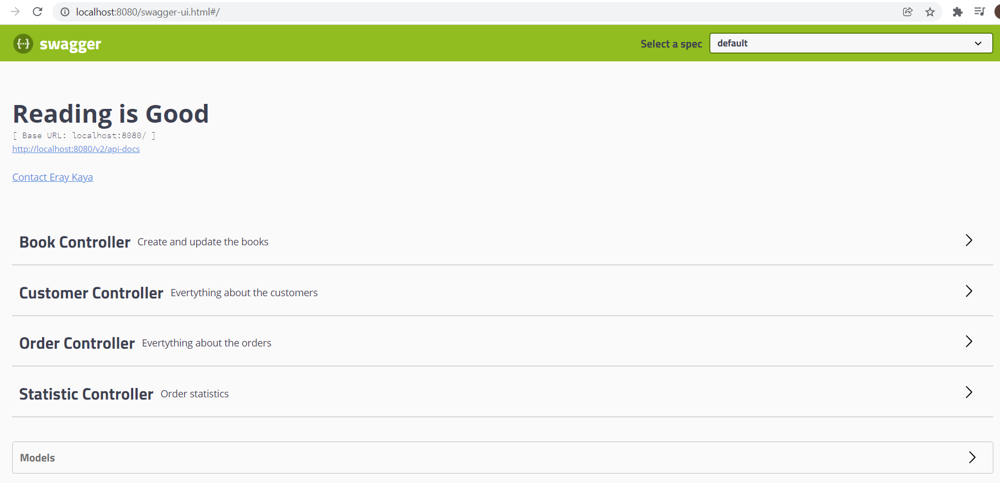
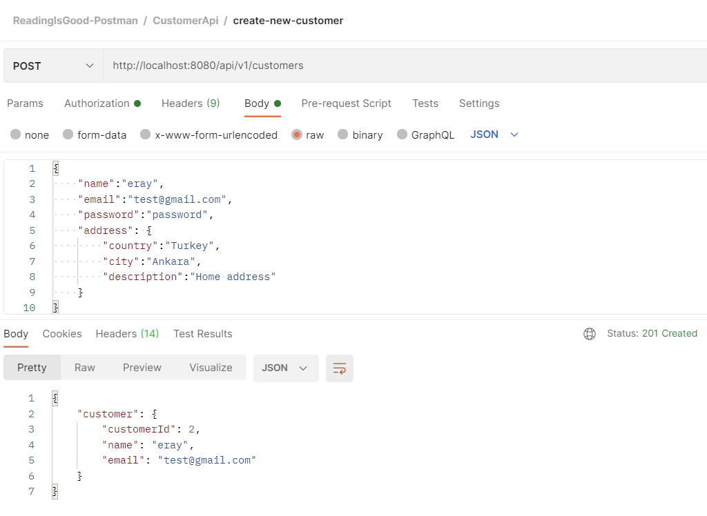
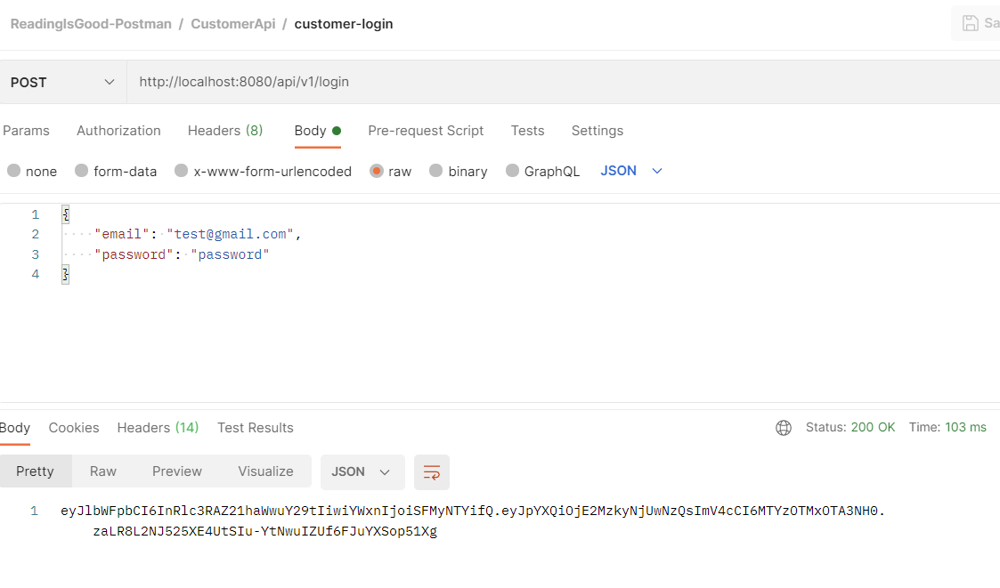
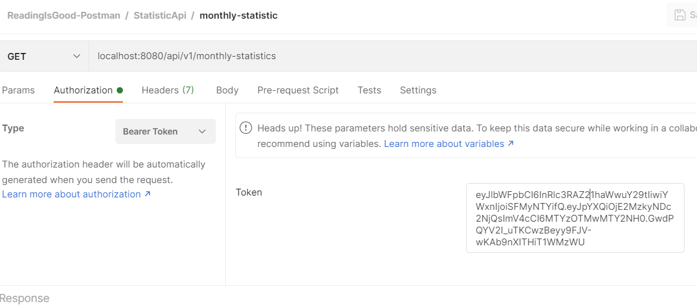
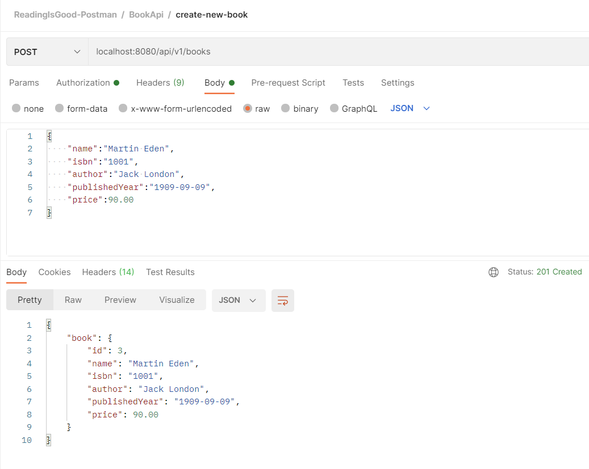
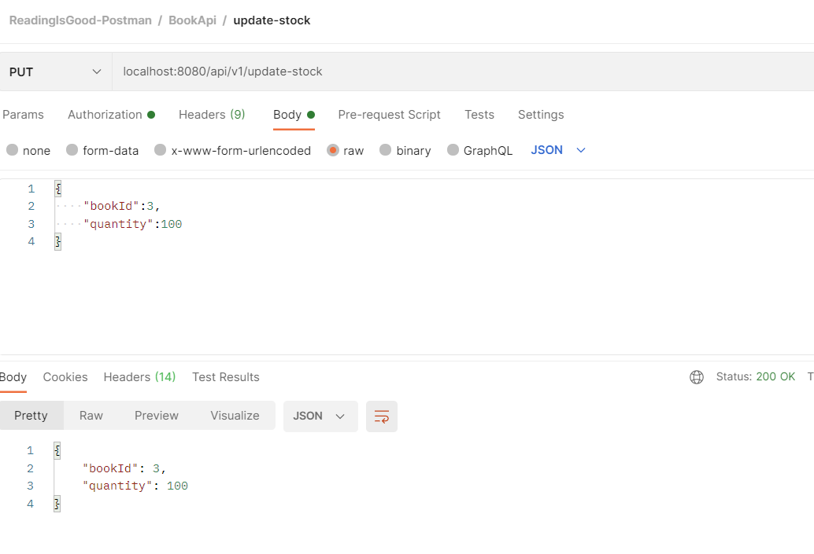
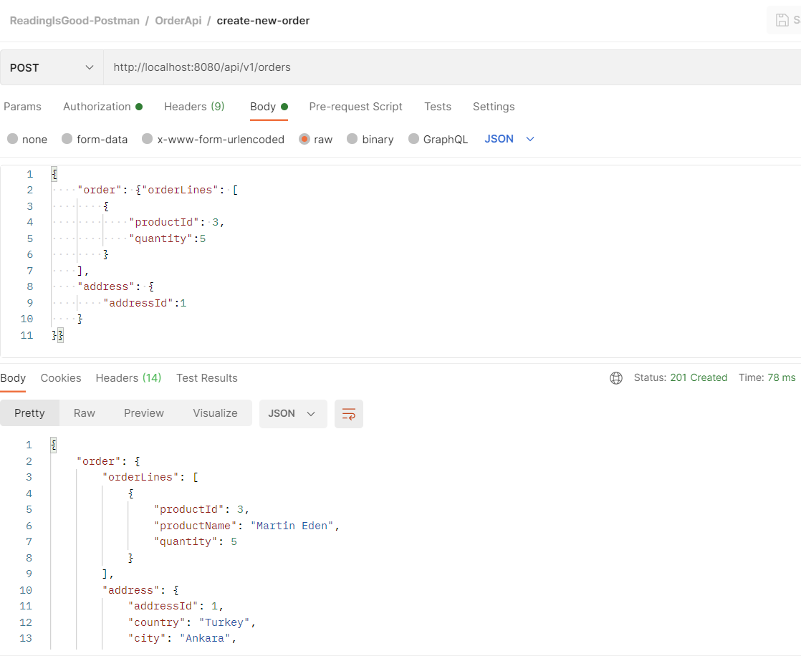
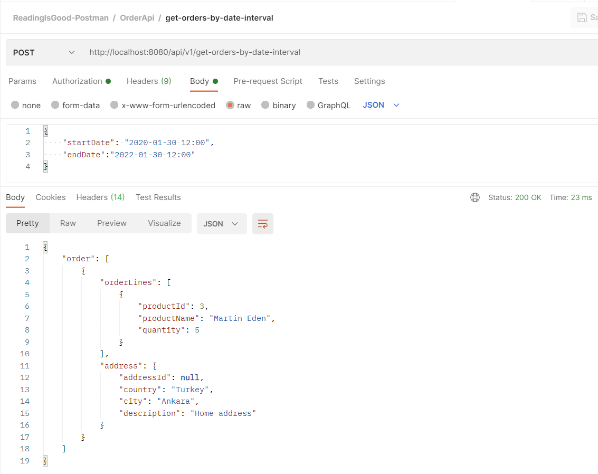
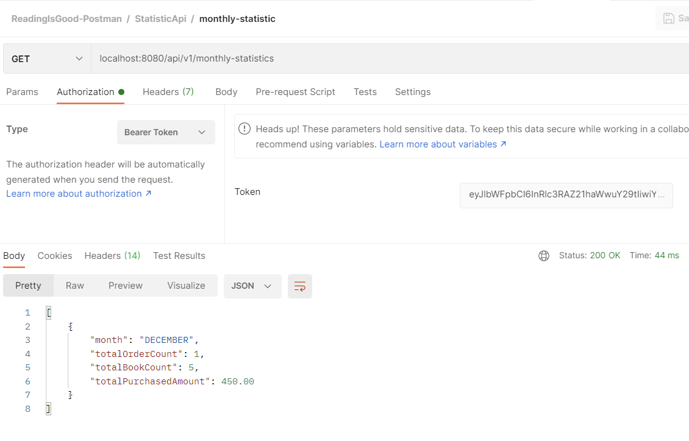

# READING IS GOOD

<p>
  
</p>

ReadingIsGood app is an online book selling app.

Restful Service uses following technologies:

* Spring-boot
* Spring-data
* Spring-rest
* Hibernate
* Spring-security
* H2 DB
* Swagger2
* Lombok
* JWT

# How to Start Project (Local)

```
mvn clean package
java -jar ./target/ReadingIsGood-0.0.1.jar
```

# How to Start Project (Container)

```
mvn clean package
docker build -f Dockerfile -t reading-is-good .  
docker run -p 8080:8080 reading-is-good  
```  

## Code coverage report
	\target\site\jacoco\index.html

## Logs
	\logs\readingisgood-logger.log


# Swagger Documentation
Swagger Address : http://localhost:8080/swagger-ui.html



# How to Use the App

### Create New Customer

To create a new customer, you can request as follows


### Generate JWT Token

To generate a new token, you can request as follows


### Use JWT Token 
 
You can use the token as follows


### Create New Book

To create a new book, you can request as follows


### Update Stock

To update a book, you can request as follows


### Create New Order

To create a new order, you can request as follows


### Orders By Date Interval

You can get orders by date interval


### Monthly Statistic

You can get monthly statistics


# Postman collection

File Location : /docs/ReadingIsGood-Postman.postman_collection.json

